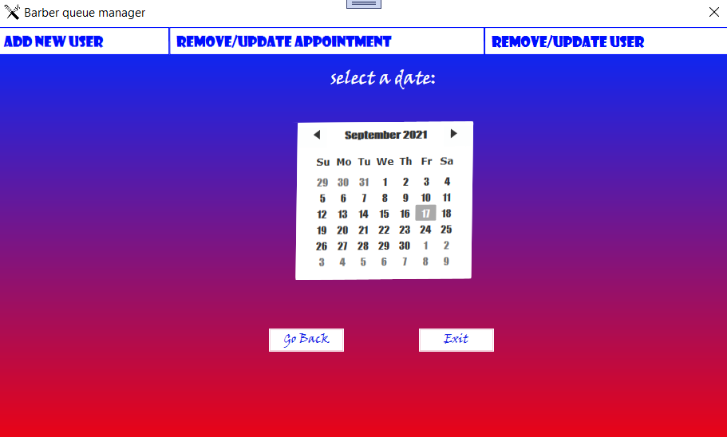

# Barber-Manager
The Barber Manager application manages a barber schedule and helps with making new appointments according to the annual schedule. 
This is a WPF project based on C# code that interfacing to the SQLite database.

## Screens:

### Login page:

### Homepage:

### Appointments managemnet page:

### Manage users page:

